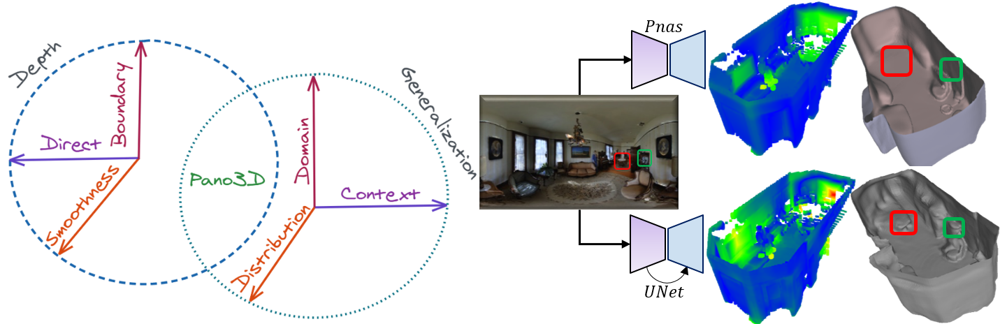

# Pano3D
This repo contains the source code for project's web page.

## A Holistic Benchmark and a Solid Baseline for 360o Depth Estimation

<!-- https://academia.stackexchange.com/questions/27341/flair-badge-for-arxiv-paper -->
<!-- https://zenodo.org/badge/doi/10.5281/zenodo.4018965.svg?color=yellow -->
<!-- https://github.com/bionanoimaging/UC2-GIT/issues/44 -->

> Pano3D  is a new benchmark for depth estimation from spherical panoramas. 
We generate a dataset (using GibsonV2) and provide baselines for holistic performance assessment, offering:
1. Primary and secondary traits metrics:
     - Direct **depth** performance:
        - (w)RMSE
        - (w)RMSLE
        - AbsRel
        - SqRel
        - (w)Relative accuracy (`\delta`) @ {`1.05`, `1.1`, `1.25`, `1.25`2, `1.25`3 }
    - Boundary **discontinuity** preservation:
        - Precision @ {`0.25`, `0.5`, `1.0`}m
        - Recall @ {`0.25`, `0.5`, `1.0`}m
        - Depth boundary errors of accuracy and completeness
    - Surface **smoothness**:
        - RMSEo
        - Relative accuracy (`\alpha`) @ {`11.25`o, `22.5`o, `30`o}
2. Out-of-distribution & Zero-shot cross dataset transfer:
    - Different depth distribution test set
    - Varying scene context test set
    - Shifted camera domain test set
> By disentangling generalization and assessing all depth properties, Pano3D aspires to drive progress benchmarking for 360o depth estimation.

> Using Pano3D to search for a solid baseline results in an acknowledgement of exploiting complementary error terms, adding encoder-decoder skip connections and using photometric augmentations.

### TODO
- [x] Web Demo
- [x] Data Download
- [x] Loader & Splits
- [ ] Models Weights Download
- [ ] Model Serve Code
- [ ] Model Hub Code
- [ ] Metrics Code

### Demo

A publicly hosted demo of the baseline models can be found [here](https://share.streamlit.io/tzole1155/threedit).
Using the web app, it is possible to upload a panorama and download a 3D reconstructed mesh of the scene using the derived depth map.
> Note that due to the external host's caching issues, it might be necessary to refresh your browser's cache in between runs to update the 3D models.

### Data

#### Download
To download the data, follow the instructions at [vcl3d.github.io/Pano3D/download/](https://vcl3d.github.io/Pano3D/download/).
> Please note that getting access to the data download links is a **two** step process as the dataset is a derivative and compliance with the original dataset's terms and usage agreements is required. Therefore:
1. You first need to fill in this [Google Form](https://forms.gle/SJUqLZYmu8sogwrAA).
2. And, then, you need to perform an access request at each one of the Zenodo repositories (depending on which dataset partition you need):
    -  [Matterport3D Train & Test (/w Filmic) High Resolution (`1024 x 512`)](https://zenodo.org/record/5707345#.YZY3-2BByUk)
    -  [GibsonV2 Full (w/o normals) High Resolution (`1024 x 512`)](https://zenodo.org/record/4986012#.YM9K1fkzaUl)
    -  [GibsonV2 Tiny, Medium & Fullplus (w/o normals) High Resolution (`1024 x 512`)](https://zenodo.org/record/4991961#.YM9K3fkzaUl)
    -  [GibsonV2 Tiny & Fullplus Filmic High Resolution (`1024 x 512`)](https://zenodo.org/record/5016572#.YNMv7_kzaUk)
    -  [Matterport3D Train & Test (/w Filmic) Low Resolution (`512 x 256`)](https://zenodo.org/record/4957305#.YM9K6PkzaUl)
    -  [GibsonV2 Full Low Resolution (`512 x 256`)](https://zenodo.org/record/4966769#.YM9K6fkzaUl)
    -  [GibsonV2 Tiny, Medium & Fullplus (/w Filmic) Low Resolution (`512 x 256`)](https://zenodo.org/record/4966684#.YM9K6fkzaUl)

After both these steps are completed, you will soon receive the download links for each dataset partition.

#### Loader

#### Splits

### Models

#### Download

#### Inference

#### Serve

### Metrics

#### Direct

#### Boundary

#### Smoothness

### Results
