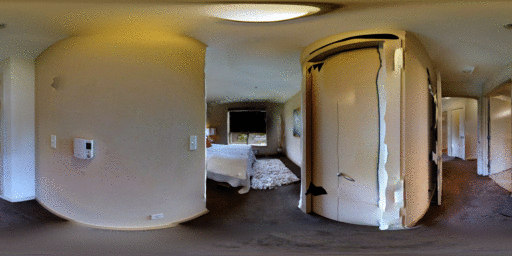

<h1 id="overview">Overview</h1>
The **Pano3D** 360o depth estimation benchmark provides a standard <a href="https://niessner.github.io/Matterport/">Matterport3D</a> train and test split, as well as a secondary <a href="http://gibsonenv.stanford.edu/database/">GibsonV2</a> partioning for testing and training as well.

The latter is used for zero-shot cross dataset transfer performance assessment and decomposes it into 3 different splits, each one ablating a specific generalization trait.

<h1> Dataset Description </h1>

<h2> Modalities </h2>

The dataset offers `3` different modalities as indicated below:

| __Image Type__        | __Data Format__           | __Invalid Value__  |
| ------------- |:-------------:|:-----:|
| `Color` | `.png` | true black,   _i.e._ `(0, 0, 0)` |
| `Depth` | single channel,   floating point `.exr` | `(inf)` |
| `Normal` | 3-channel (_x, y, z_),  floating point `.exr` | `(0.0f, 0.0f, 0.0f)`   & `(nan, nan, nan)` |

Each modality has a corresponding data format and invalid values (due to imperfect scanning, holes manifest during rendering).

<h2> Samples </h2>

 <h3> GibsonV2 Tiny </h3>
  
 
    
  
  
  
  <h3> GibsonV2 Medium </h3>
  
 
    
  
  
  
  <h3> GibsonV2 Fullplus </h3>
  
 
    
  
  
  
  <h3> GibsonV2 Full </h3>
  
 
    
  
  

 <h3> GibsonV2 Tiny Filmic </h3>
  
 
    
  
  
  
  <h3> GibsonV2 Fullplus Filmic </h3>
  
 
    
  
  

 <h1> Usage </h1>

 <h1> Download Data </h1>

                To download the <i>Pano3D</i> dataset we follow a two-step process:
                        <ol>
                            <li>
                                Access to the <i>Pano3D</i> dataset requires agreement with the terms and conditions for each of the 3D datasets
                                that were used to create (i.e. render) it, and more specifically, Matterport3D [<a href="#Matterport3D"><b>1</b></a>] and GibsonV2 [<a href="#GibsonV2"><b>2</b></a>]. 
                                Therefore, in order to grant you access to this dataset, we need you to first fill <a href="" >request form</a>.
                            </li>
                            <li>
                                Then, you need to perform a request for access to the respective Zenodo repositories, 
                                where the data are hosted. 
                                Due to data-size limitations, the dataset is split into six (6) repositories, 
                                which respectively contain the color image, depth and normal map renders for each image. 
                                The repositories are split into the two resolutions, with each subgroup of 3 repositories 
                                containing the entire Matterport3D dataset renders, the entire GibsonV2 test split renders, 
                                and the remainder of GibsonV2 which is used as additional training data. 
                                Therefore, a separate request for access needs to be made to each repository in order to download 
                                the corresponding data. 
                            </li>
                        </ol>
                        <b>Note</b> that only completing one step of the two (i.e. only filling out the form, or only requesting access 
                        from the Zenodo repositories) <b>will not</b> be enough to get access to the data. 
                        We will do our best to contact you in such cases and notify you to complete all steps as needed, 
                        but our mails may be lost (e.g. spam filters/folders). 
                        The only exception to this, is if you have already filled in the form and need access to another Zenodo repository 
                        (for example you need extra dataset/splits which are hosted on different Zenodo repositories), then you only need 
                        to fill in the Zenodo request but please, make sure to mention that the form has already been filled in so that 
                        we can verify it.  

                        Each volume is broken down in several .zip files (2GB each) for more convenient downloading on low 
                        bandwidth connections. You need all the .zip archives of each volume in order to extract the containing files.

  <b>Note</b> that only completing one step of the two (<i>i.e.</i> only filling out the form, or only requesting access from the Zenodo repositories <b>will not</b> be enough to get access to the data. We will do our best to contact you in such cases and notify you to complete all steps as needed, but our mails may be lost (e.g. spam filters/folders). 
  The only exception to this, is if you have already filled in the form and need access to another Zenodo repository (for example you need extra viewpoint renders which are hosted on different Zenodo repositories), then you only need to fill in the Zenodo request but please, make sure to mention that the form has already been filled in so that we can verify it.

Each volume is broken down in several <code>.zip</code> files (2GB each) for more convinient downloading on low bandwidth connections. You need all the <code>.zip</code> archives of each volume in order to extract the containing files.

 <h2> Data splits </h2>
 We follow the same data-split logic as defined in Matterport3D. We use GV2 splits for testing only.

<!-- <h2> Data organisation</h2>
<table>
<tr>
<td>

</td>
</tr>
</table> -->
 <h1> Acknowledgements </h1>
 This dataset has been generated within the European Union’s Horizon 2020 innovation programme [ATLANTIS](https://atlantis-ar.eu/) under grant agreement No 951900.
  

 
 

 <table>
<tr>
<td>

</td>
<td>

</td>
</tr>
</table>
